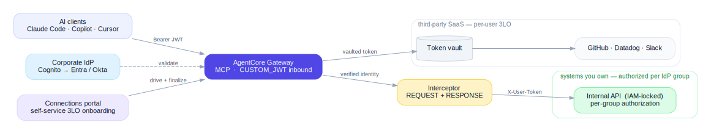
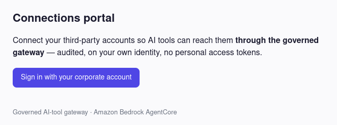
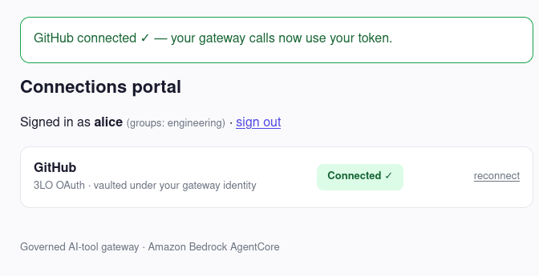
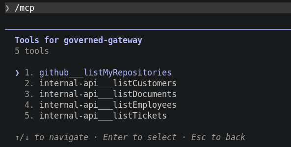

# Governed AI-tool gateway (Amazon Bedrock AgentCore)

A working proof of concept: one MCP endpoint through which AI clients
(Claude Code, Copilot, Cursor) reach internal systems and third-party SaaS.
The corporate IdP authenticates every caller, the gateway authorizes per user,
and every call maps back to a human identity. Runs entirely in your own AWS
account.

<p align="center">
  
</p>

> Engineering deep-dive in [**docs/ARCHITECTURE.md**](docs/ARCHITECTURE.md):
> components, request flows, trust boundaries, design decisions, security model.

## The problem

AI tools become genuinely useful the day they can read your internal systems:
project management, docs, customer data, APIs. So developers connect them
themselves: personal API keys pasted into configs, shared service accounts,
vibecoded MCP servers, data flows nobody reviews. Blocking the tools doesn't stop
this; it just hides it. AI tools end up connected to confidential data either
way. The only question is whether that access is governed.

## What this shows

**Per-user authorization to internal systems.** Two users in different IdP
groups call the same tool through the same gateway and get different,
correctly-scoped data, with no per-user tokens or secrets anywhere:

| Caller (IdP group) | `internal-api___listDocuments` | `internal-api___listCustomers` |
|---|---|---|
| **alice** (engineering) | engineering runbook, on-call policy | *(denied: empty)* |
| **bob** (finance) | budget model, vendor contracts | Acme, Globex |

**Per-user third-party access (3LO).** A user connects GitHub once in a
self-service portal; afterwards `github___listMyRepositories` through the
gateway returns *their* repos, served from a server-side token vault. A
different user gets their own. No OAuth token ever reaches the AI client.

<p align="center">
  
  
</p>

Both flows were verified end-to-end against live AWS, from a real MCP client.

The trust boundary is the gateway's inbound JWT authorizer. Behind it, the
internal API is IAM-locked to the gateway's role, 3LO tokens are vaulted
server-side, secrets live in Secrets Manager, and per-tool-call CloudTrail data
events attribute every call to the caller's JWT claims. Full security model,
including the demo's deliberate shortcuts:
[docs/ARCHITECTURE.md](docs/ARCHITECTURE.md#security-model).

## Deploy

Prerequisites: AWS credentials (`aws` CLI configured, default region
`eu-west-1`) and a GitHub OAuth App (*Settings → Developer settings → OAuth
Apps*) for the 3LO example; its client id/secret go in `scripts/.env`.

```bash
cp scripts/.env.example scripts/.env      # fill in GithubClientId / GithubClientSecret
scripts/deploy.sh
DEMO_PASSWORD='...' scripts/setup-demo.sh # create alice/bob + groups
scripts/publish-oauth-metadata.sh
```

Then register the printed `GithubCallbackUrl` as the OAuth App's authorization
callback URL (one-time; the URL isn't known before the first deploy), and copy
[`.mcp.json.example`](.mcp.json.example) to `.mcp.json` with the stack outputs
(all non-secret).

> `deploy.sh` re-attaches the interceptor on every run: interceptors are an
> `update-gateway` concern, not CloudFormation, so a plain stack update silently
> drops them.

## Verify

In an MCP client: open Claude Code in this repo, `/mcp`, sign in as `alice` or
`bob` (OAuth 2.1 + PKCE, no static tokens). For GitHub, open the portal
(`PortalUrl` output), connect once, then call `github___listMyRepositories`.

<p align="center">
  
</p>

Headless verification (curl, no browser): [docs/VERIFY.md](docs/VERIFY.md).
Unit tests: `python3 -m pytest tests/`

## Scope

This proves the governed path and per-user authorization, not a production
rollout:

- **Cognito stands in for the corporate IdP.** The inbound authorizer is
  IdP-agnostic; pointing it at Entra ID or Okta is a config change, and a
  token-exchange-capable IdP unlocks OBO.
- **The internal API trusts the gateway-forwarded identity** (IAM-isolated, but
  no JWT re-verification). Production re-verifies via JWKS or uses OBO token
  exchange.
- **Tools are read-only.** Write actions could add policy interceptors
- **Legacy / on-prem systems** that don't consume IdP JWTs need a custom adapter (PATs, reverse-proxy SSO); the gateway doesn't solve that as-is.

The production-hardening roadmap and the alternatives considered (DIY,
self-hosted MCP gateways, AI gateways) are in
[docs/ARCHITECTURE.md](docs/ARCHITECTURE.md#production-hardening--roadmap).
