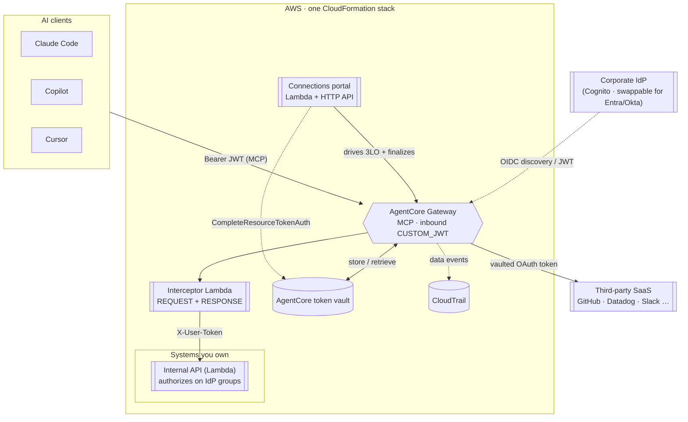
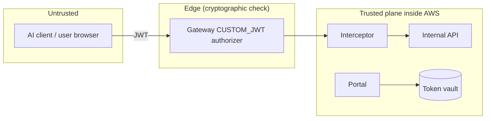
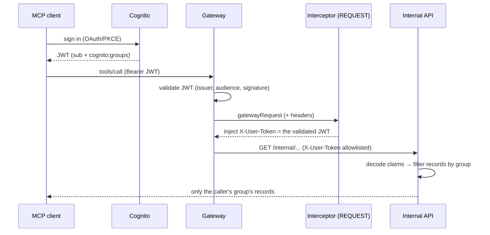
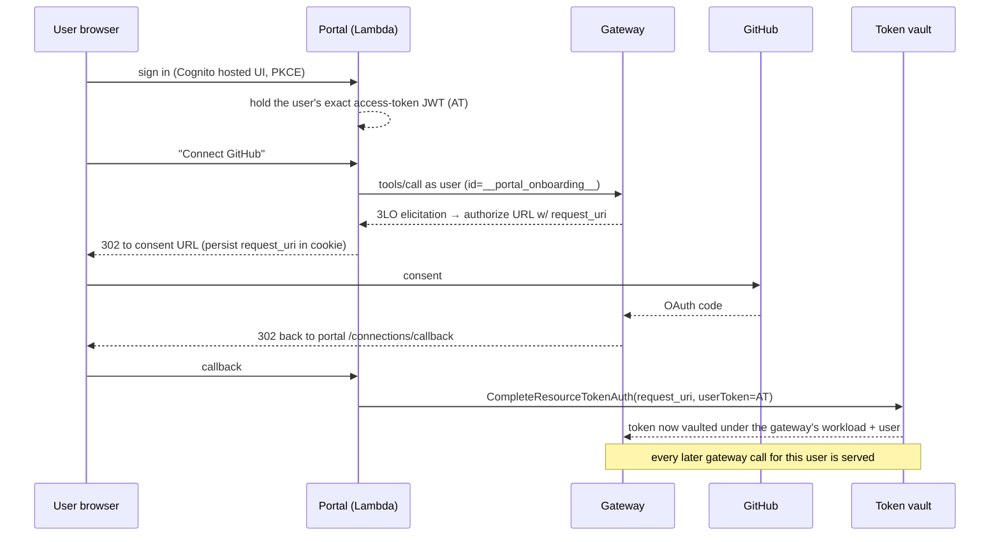
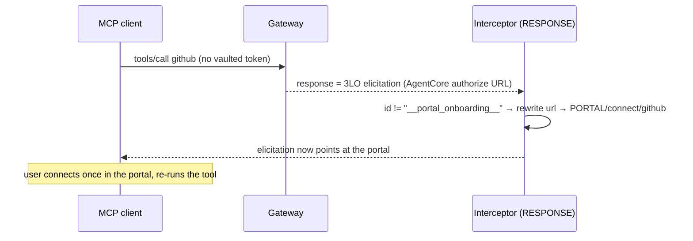

# Architecture

How the governed AI-tool gateway is built: components, trust boundaries, request
flows, and the design decisions behind it. For the business-level "why", see the
[README](../README.md).

> **Note:** This document is AI-generated, based on the author's vision, design
> decisions, and the system as built.

- [System overview](#system-overview)
- [Components](#components)
- [Trust boundaries](#trust-boundaries)
- [Flow 1: per-user authorization to internal systems](#flow-1-per-user-authorization-to-internal-systems)
- [Flow 2: third-party 3LO onboarding (the connections portal)](#flow-2-third-party-3lo-onboarding-the-connections-portal)
- [Flow 3: graceful in-client onboarding](#flow-3-graceful-in-client-onboarding)
- [Key design decisions](#key-design-decisions)
- [Security model](#security-model)
- [Production hardening / roadmap](#production-hardening--roadmap)
- [Why AgentCore, and alternatives considered](#why-agentcore-and-alternatives-considered)

---

## System overview

One MCP endpoint fronts everything an AI client is allowed to reach. A corporate
IdP authenticates the caller at the edge; from there the gateway routes to two
classes of backend with two different authorization models:

- **Systems you own / that trust your IdP**: the gateway forwards the caller's
  verified identity and the backend authorizes per-user on IdP claims.
- **Third-party SaaS (per-user 3LO)**: the gateway attaches each user's vaulted
  OAuth token to the outbound call; users onboard once via a self-service portal.

---

## Components

Everything is one SAM/CloudFormation stack ([`template.yaml`](../template.yaml)).

| Component | Resource(s) | Responsibility |
|---|---|---|
| **Inbound IdP** | `AWS::Cognito::UserPool` + domain + app client + groups | Authenticates callers; issues the JWT the gateway validates. Stands in for a corporate IdP. |
| **Gateway** | `AWS::BedrockAgentCore::Gateway` | The MCP endpoint. `CUSTOM_JWT` inbound authorizer; routes tool calls to targets; manages outbound OAuth against the token vault. |
| **Interceptor** | `AWS::Serverless::Function` ([`src/interceptor/`](../src/interceptor/)) + `update-gateway` | One Lambda at two points. **REQUEST**: stamps the caller's validated JWT onto internal-tool calls as `X-User-Token`. **RESPONSE**: rewrites un-completable 3LO elicitations to the portal. |
| **Internal API** | `AWS::Serverless::Function` ([`src/internal_api/`](../src/internal_api/)) behind an **IAM-authed** API Gateway v2 HTTP API, exposed as an OpenAPI **gateway target** | A mock system-you-own that authorizes per request on the caller's `cognito:groups`. Only the gateway's SigV4 role can reach it. |
| **GitHub target** | `AWS::BedrockAgentCore::OAuth2CredentialProvider` + `GatewayTarget` | A third-party 3LO example (`AUTHORIZATION_CODE`), served from per-user vaulted tokens. |
| **Connections portal** | `AWS::Serverless::Function` ([`src/portal/`](../src/portal/)) + `AWS::Serverless::HttpApi` + a 2nd Cognito app client + a cookie-signing secret | Self-service onboarding: signs the user in, drives the gateway's 3LO, finalizes the token binding. |
| **OAuth metadata** | `AWS::S3::Bucket` + policy | Serves a corrected RFC 8414 authorization-server document (works around a Cognito discovery gap). |
| **Audit** | CloudTrail (account-level) | Identity/management API calls appear in the default event history. Per-tool-call audit (`InvokeGateway` data events, attributed via the caller's JWT claims) requires a trail with AgentCore Gateway data events explicitly enabled. |

All three Lambdas are stdlib-only (no boto3; the portal's one AWS API call is
SigV4-signed by hand) and ship from [`src/`](../src/), packaged by
[`scripts/deploy.sh`](../scripts/deploy.sh). The portal is layered:
`domain/` (sessions, providers, gateway-reply interpretation; pure, no I/O),
`application/` (login and connection use cases), `adapters/` (Cognito, gateway
MCP, AgentCore SigV4, signed cookies), with routing in `app.py` and HTML in
`views.py`. The pure parts carry the unit tests ([`tests/`](../tests/)).

---

## Trust boundaries

- The **only** place an unauthenticated request is rejected on cryptographic
  grounds is the gateway's inbound authorizer. Everything behind it treats the
  forwarded identity as already-validated.
- The **internal API is reachable only via the gateway**, enforced rather than assumed:
  its HTTP API route requires `AWS_IAM` authorization, so only the gateway's
  SigV4-signed role gets in (a direct call with a spoofed header returns `403`). It
  then *trusts* the forwarded `X-User-Token` for claims without re-verifying the
  signature; that is the demo's one deliberate shortcut, closed in production by JWKS
  re-verify or OBO token exchange (see [Security model](#security-model)).
- **Secrets** (GitHub client secret, cookie key) live in Secrets Manager; the
  gateway and portal roles read only the specific `bedrock-agentcore-identity!*`
  paths. No secret is ever handed to an MCP client.

---

## Flow 1: per-user authorization to internal systems

Two users in different IdP groups call the **same tool** and get **different,
correctly-scoped data**, with no per-user tokens or secrets anywhere.

Why a **custom header** and not `Authorization`? The gateway owns the outbound
`Authorization` header (its `GATEWAY_IAM_ROLE` SigV4 credential), so the
interceptor stamps identity onto `X-User-Token` instead, and the target must
**allowlist** it (`MetadataConfiguration.AllowedRequestHeaders`), or the gateway
strips it. Both facts are load-bearing; see [design decisions](#key-design-decisions).

This is the scalable model: the **IdP is the single source of identity**, so there
is nothing per-user to provision: add a user to a group and access follows.

---

## Flow 2: third-party 3LO onboarding (the connections portal)

Third-party SaaS authenticates each user with their own OAuth consent (3LO).
AgentCore vaults a per-user token, but **finalizing** the flow
(`CompleteResourceTokenAuth`) is an AWS API call no bare MCP client makes. The
portal performs that one-time onboarding.

The subtle, essential part: the portal must finalize the **exact** gateway-initiated
session with the **exact** JWT that started it, because the vault is
workload-scoped and completion is identity-bound. See the next section.

---

## Flow 3: graceful in-client onboarding

If a user calls a 3LO tool they haven't connected, the gateway returns a URL
elicitation, but the URL is AgentCore's authorize endpoint, which a bare client
can't finalize. A **RESPONSE interceptor** rewrites that elicitation to point at
the portal instead, turning a dead end into a working onboarding link.

The interceptor **skips** rewriting the portal's own probe (tagged with a sentinel
JSON-RPC `id`), because the portal genuinely needs the real `request_uri`. Level 2
(auto-resolving the pending call so no re-run is needed) is a documented follow-up.

---

## Key design decisions

Each of these was discovered against the live service, and each is load-bearing.

1. **Identity is forwarded, not impersonated.** The interceptor passes the caller's
   already-validated JWT to the backend as `X-User-Token`; the backend authorizes on
   it. No shared service account, no per-user PAT. The stronger production variant is
   OBO token exchange (below).

2. **The token vault is workload-scoped.** A vaulted 3LO token is keyed by
   *(workload identity, provider, user)*, **not** by user alone. Empirically, a
   token vaulted under a portal's own workload identity is invisible to the gateway's
   workload. So the portal cannot vault a usable token under its own identity.

3. **The gateway's workload identity is service-linked (un-borrowable).**
   `GetWorkloadAccessTokenForUserId/ForJWT` against the gateway's workload returns
   `WorkloadIdentity is linked to a service…`. Combined with (2), the only way to put
   a token where the gateway will find it is to have the **gateway** initiate the flow
   and then finalize *that* session. That's exactly what the portal does.

4. **Completion is identity-bound to the exact JWT.** Finalizing a gateway-initiated
   session with `userId=` fails (`Invalid or expired session`); it must be
   `userToken=<the exact JWT>` the gateway minted its workload token from. So the
   portal must hold and reuse that token, which it does, because it made the
   triggering call itself.

5. **The portal's URL can't be referenced by anything the portal depends on.** The
   Lambda must not read its own API's generated URL (it derives the base URL at
   runtime from `requestContext.domainName`), and the Cognito callback URL is set
   **post-deploy** in `deploy.sh`; otherwise `PortalFn → PortalClient → PortalApi →
   PortalFn` is a CloudFormation circular dependency.

6. **Interceptors are out-of-band and get wiped by CFN.** They're configured via
   `update-gateway`, not CloudFormation, so any CFN update to the Gateway re-states
   its config *without* the interceptor. `deploy.sh` therefore re-runs
   [`attach-interceptor.sh`](../scripts/attach-interceptor.sh) after every deploy.

7. **Never delete+recreate a credential provider to clear tokens.** The provider's
   OAuth callback URL contains a GUID that **rotates** on recreate, breaking the
   registered redirect_uri in the SaaS OAuth app. To reset a user, use a fresh
   identity (empty vault entry) instead.

8. **Cognito isn't a fully MCP-compliant auth server.** It serves no RFC 8414
   metadata and its OIDC discovery omits the PKCE fields a public client needs, so
   [`publish-oauth-metadata.sh`](../scripts/publish-oauth-metadata.sh) serves a
   corrected document from S3. A DCR + RFC 8414 IdP (Entra/Okta/Auth0) removes this
   *and* gets MCP clients to "just the gateway URL" config.

---

## Security model

| Concern | This demo | Production |
|---|---|---|
| Inbound auth | Cognito `CUSTOM_JWT` (issuer/aud/signature) | Same, pointed at the corporate IdP |
| Internal-API reachability | `AWS_IAM` route auth: only the gateway's signed role reaches it (spoofed direct call → `403`) | Same |
| Internal-API trust | Decodes the forwarded JWT for claims without re-verifying its signature | Re-verify via JWKS, or use **OBO token exchange** (RFC 8693) so the target gets an audience-scoped token it verifies natively |
| Secrets | Secrets Manager; scoped read on `bedrock-agentcore-identity!*` | Same + rotation; per-provider scoping |
| Portal session | HMAC-signed cookie (key in Secrets Manager); holds the user's *own* JWT only | Server-side session store; refresh-token handling |
| Token exposure | No token ever reaches an MCP client; vaulted server-side | Same |
| Revocation | Bounded by token TTL (Cognito access token: 60 min default here; configurable from 5 min up to 24 h) | Short TTL + token revocation / deny-list |
| Audit | CloudTrail; per-tool-call data events attributed to the human identity (JWT claims) once enabled on a trail | Data events enabled + SIEM export, per-tool alerting |
| Blast radius | One user's vault entry per (provider, user) | Same; revoke one entry to cut one user |

In one line: this proves the governed path and per-user authorization; the
internal-API-trusts-the-gateway shortcut and the cookie session store are the two
things production replaces first.

### Threat notes
- **Stolen client JWT** → valid until expiry; mitigated by short TTL. The token is
  scoped to the gateway (audience) and grants only the caller's own access.
- **Compromised portal** → could initiate onboarding, but every token is bound to a
  consenting user's identity and vaulted server-side; it cannot exfiltrate existing
  tokens: its role has only `CompleteResourceTokenAuth` (not `GetResourceOauth2Token`,
  the API that serves tokens), and the read path needs the gateway's workload token,
  which is service-linked and un-mintable. It also cannot impersonate the internal
  API's trust of the gateway.
- **Public S3 metadata / public portal / public internal-API route** → all contain
  no secrets; the internal-API route is meaningful only with an interceptor-injected,
  gateway-validated `X-User-Token`.

---

## Production hardening / roadmap

- **OBO token exchange** for internal systems (audience-scoped, natively verified):
  a config change on a token-exchange-capable IdP.
- **DCR + RFC 8414 IdP** (Entra/Okta/Auth0) → MCP clients need only the gateway URL;
  drops the S3 metadata workaround.
- **Portal**: server-side session store (DynamoDB), refresh-token handling, connection
  management UI (list/revoke), and the "Level 2" seamless in-client onboarding that
  auto-resolves the pending call.
- **Per-provider least-privilege scopes** and consent screens per tool (the demo
  vaults GitHub's broad `repo` scope while exposing only a read-only tool).
- **Observability**: structured audit export, per-tool rate limits, WAF on the public
  API surfaces, and CloudWatch alarms on 3LO/interceptor errors.
- **Write tools & approvals**: the exposed tool surface is read-only; write actions
  would add policy-engine interceptors and human-in-the-loop approval.

---

## Why AgentCore, and alternatives considered

**AgentCore Gateway** was chosen because it provides, as managed primitives, the
exact hard parts of this problem: an MCP-native endpoint, a pluggable JWT authorizer,
a **per-user OAuth token vault** with 3LO/2LO/OBO grant types, request/response
interceptors, and CloudTrail auditing (per-call data events, enabled per trail), all inside the customer's own AWS
account and IAM. The differentiated value of this repo is knowing how those
primitives actually compose (the [design decisions](#key-design-decisions) above),
which is not obvious from the docs.

Alternatives on the table, and the trade-off:

- **DIY: API Gateway + Lambda + your own token store.** Maximum control, but you
  rebuild the token vault, OAuth flows, and MCP semantics yourself: months of
  undifferentiated work and a bigger security surface to own.
- **Self-hosted MCP gateway / registry** (e.g. the open-source `mcp-gateway-registry`
  pattern). Great for cataloguing and routing MCP servers; weaker on *per-user
  outbound identity* and managed token vaulting, which is the crux here.
- **AI gateways / managed inference platforms** (e.g. LiteLLM, Nebius Token Factory).
  Strong on model routing, rate limiting, and cost controls; complementary
  rather than competing; they don't solve per-user 3LO to internal SaaS on your own
  AWS/IAM.
